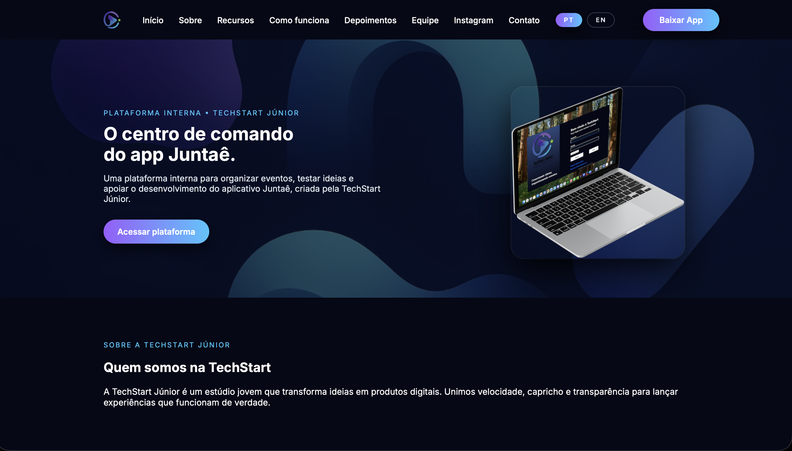
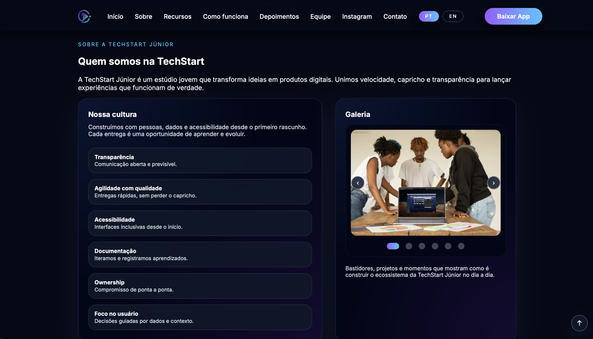

# TechStart Website

Landing page developed to present a fictional technology/events company.

This project was created to practice front-end development, layout structuring, and responsive design, simulating a real-world product.

## Technologies

- HTML  
- CSS  
- JavaScript  

## Features

- Company presentation section  
- Services overview  
- Testimonials section  
- Responsive design for different devices  

## Live Demo

👉 https://ghostriley115.github.io/techstart-landing-page/

## Objective

To practice web development and build modern user interfaces, simulating a real project for portfolio purposes.

## Project Context

This project is part of a larger system developed for a fictional tech/events company.

The website acts as a landing page to present the business, its services, and guide users to the main system.

The main system is a desktop application built with C#, where users can manage products and events through a full CRUD interface.

Together, these projects simulate a real-world scenario where a company has both a public website and an internal management system.

## 🔗 Related Projects

- Desktop Management System (C#)

## Preview

  

