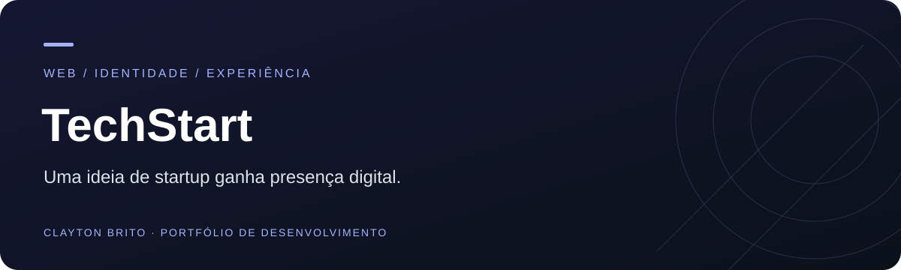
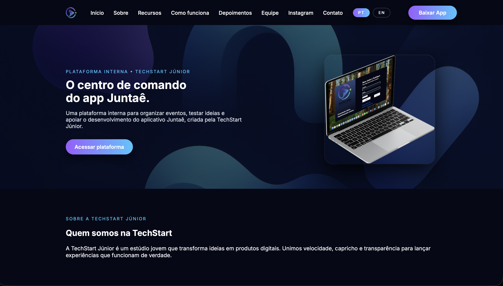
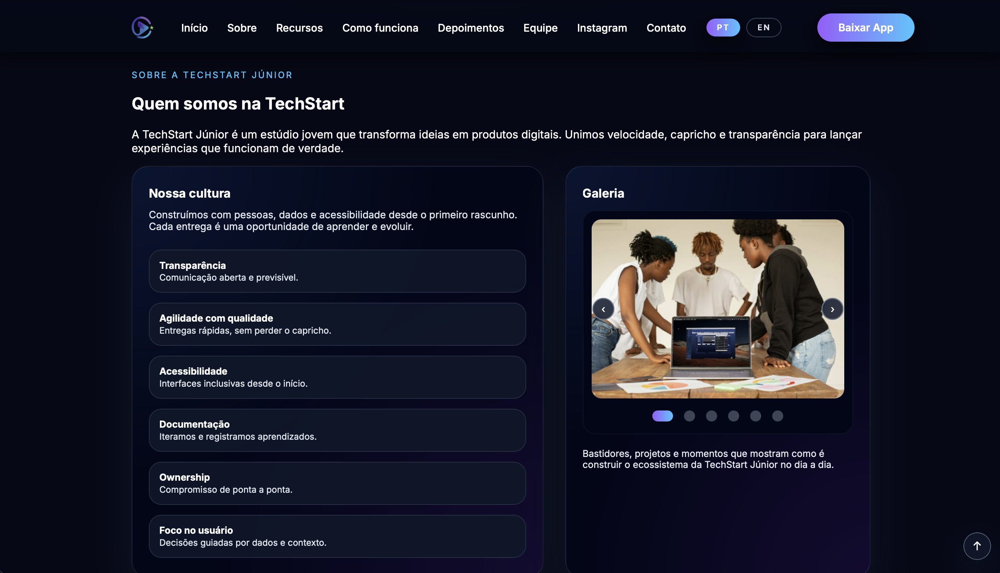

<div align="center">

# TechStart · landing page

**Uma apresentação digital para uma startup fictícia e suas ideias de produto.**

`HTML` · `CSS` · `JavaScript` · `GitHub Pages`

[**Visitar o site ↗**](https://ghostriley115.github.io/techstart-landing-page/) · [Sistema desktop](https://github.com/GhostRiley115/crud-desktop-app)

</div>

## Da ideia à apresentação

Esta landing page apresenta a TechStart em um contexto acadêmico: sua identidade, proposta e materiais visuais. O projeto combina conteúdo institucional, galeria e mockups para comunicar a ideia da startup e aproximar o visitante das soluções apresentadas.

## Uma visão do projeto



<details>
<summary><strong>Ver a galeria da apresentação</strong></summary>



</details>

## Destaques

- Identidade visual própria aplicada ao conteúdo da startup.
- Apresentação das soluções com imagens e mockups.
- Galeria visual com carrossel.
- Alternância de textos entre português e inglês.
- Menu de navegação para telas menores.
- Estrutura em HTML, CSS e JavaScript, sem etapa de compilação.
- Publicação estática no GitHub Pages.

Os mockups comunicam os produtos e conceitos apresentados. Sua presença na página não significa que todas as funcionalidades ilustradas estejam implementadas. O sistema Windows Forms tem código em um [repositório separado](https://github.com/GhostRiley115/crud-desktop-app).

## Estrutura

```text
docs/
├── index.html     # Página principal
├── css/           # Estilos
├── js/            # Interações
└── img/           # Identidade, galeria e mockups
```

## Executar localmente

Clone o repositório e sirva a pasta `docs` com um servidor estático. Exemplo com Python 3:

```bash
git clone https://github.com/GhostRiley115/techstart-landing-page.git
cd techstart-landing-page
python3 -m http.server 8000 --directory docs
```

Abra [localhost:8000](http://localhost:8000). Também é possível usar a extensão Live Server do editor, apontando para `docs/index.html`.

## Projetos conectados

| Projeto | O que apresenta |
| :--- | :--- |
| [TechStart Desktop](https://github.com/GhostRiley115/crud-desktop-app) | Aplicação C# para eventos e produtos |
| [Jujuba’s Dev](https://ghostriley115.github.io/Jujubas-LandindPage/) | Portfólio que reúne TechStart e Kiora |

TechStart é uma iniciativa fictícia para fins acadêmicos. [Veja mais projetos de Clayton Brito →](https://github.com/GhostRiley115)
